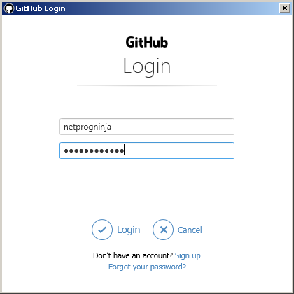
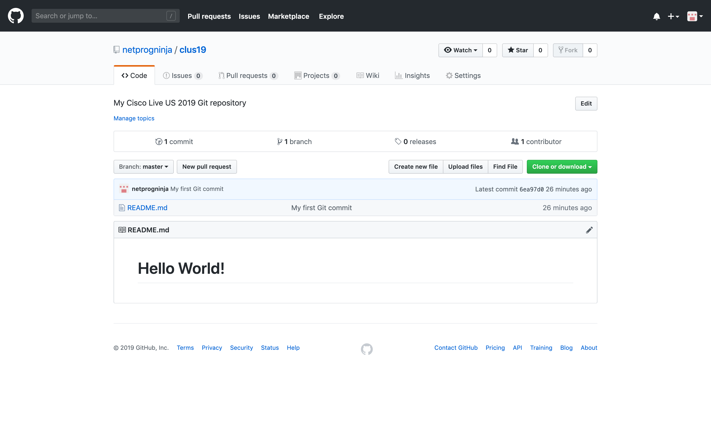

Navigation :: [Previous Page](LTRPRG-1100-02a2-Git-Ex1.md) :: [Table of Contents](LTRPRG-1100-00-Intro.md#table-of-contents) :: [Next Page](LTRPRG-1100-02a4-Git-Ex3.md)

---

### Exercise 2: Introducing Git Concepts and Commands

#### Objectives

The objectives for this exercise are to:

* Understand key Git version control system concepts
* Introduce the basic Git commands
* Learn how to work with a local Git repository
* Learn how to work with a remote Git repository

#### Step 1: Understanding Git Version Control Concepts

There is a simple flow to using Git for version control:


You start by either creating a new Git repository or cloning an existing Git repository hosted on a remote server.
In doing so, you create the Git directory (also called the repository), a working directory, and a staging area (also 
called the index).  The Git directory contains the metadata and object database and is copied from the server when 
a repository is cloned.  The working directory contains one version of the project copied to the file system 
from the compressed object database in the Git directory.  The staging area is a file inside the Git directory 
that contains an index of changes that are waiting to be committed.

Files that are changed but not staged are considered modified.  Files that are changed and added to the staging 
area are considered staged.  Files in the Git directory are considered committed.  In the next step, we will learn 
how to initialize and clone repositories; modify, stage, and commit changes; and push those changes to GitHub.

#### Step 2: Introducing Git Commands

Git has command line commands for managing Git repositories.  Here are the key commands and their usage you will need
to get started using Git successfully.

1. Open the Git Bash terminal by double clicking the Git Bash icon on the desktop:
    
    
    
    

2. For a list of common Git commands, run the `git help` command, for example:
    
    ```
    $ git help
    usage: git [--version] [--help] [-C <path>] [-c <name>=<value>]
           [--exec-path[=<path>]] [--html-path] [--man-path] [--info-path]
           [-p | --paginate | -P | --no-pager] [--no-replace-objects] [--bare]
           [--git-dir=<path>] [--work-tree=<path>] [--namespace=<name>]
           <command> [<args>]
    
    These are common Git commands used in various situations:
    
    start a working area (see also: git help tutorial)
       clone      Clone a repository into a new directory
       init       Create an empty Git repository or reinitialize an existing one
    
    work on the current change (see also: git help everyday)
       add        Add file contents to the index
       mv         Move or rename a file, a directory, or a symlink
       reset      Reset current HEAD to the specified state
       rm         Remove files from the working tree and from the index
    
    examine the history and state (see also: git help revisions)
       bisect     Use binary search to find the commit that introduced a bug
       grep       Print lines matching a pattern
       log        Show commit logs
       show       Show various types of objects
       status     Show the working tree status
    
    grow, mark and tweak your common history
       branch     List, create, or delete branches
       checkout   Switch branches or restore working tree files
       commit     Record changes to the repository
       diff       Show changes between commits, commit and working tree, etc
       merge      Join two or more development histories together
       rebase     Reapply commits on top of another base tip
       tag        Create, list, delete or verify a tag object signed with GPG
    
    collaborate (see also: git help workflows)
       fetch      Download objects and refs from another repository
       pull       Fetch from and integrate with another repository or a local branch
       push       Update remote refs along with associated objects
    
    'git help -a' and 'git help -g' list available subcommands and some
    concept guides. See 'git help <command>' or 'git help <concept>'
    to read about a specific subcommand or concept.
    $
    ```
    
    For help with a specific Git command, use the `-h` command line argument: `git <command> -h` (replacing 
    `<command>` with a specific Git command).  For example, we know `help` is a git command from the previous 
    example, so try the `git help -h` command:
    
    ```
    $ git help -h
    usage: git help [--all] [--guides] [--man | --web | --info] [<command>]

    -a, --all             print all available commands
    -g, --guides          print list of useful guides
    -c, --config          print all configuration variable names
    -m, --man             show man page
    -w, --web             show manual in web browser
    -i, --info            show info page
    -v, --verbose         print command description
    $
    ```
    
    Choose another Git command listed in the output of `git help`, for example try the `git status -h` command:
    
    ```
    $ git status -h
    usage: git status [<options>] [--] <pathspec>...

    -v, --verbose         be verbose
    -s, --short           show status concisely
    -b, --branch          show branch information
    --show-stash          show stash information
    --ahead-behind        compute full ahead/behind values
    --porcelain[=<version>]
                          machine-readable output
    --long                show status in long format (default)
    -z, --null            terminate entries with NUL
    -u, --untracked-files[=<mode>]
                          show untracked files, optional modes: all, normal, no. (Default: all)
    --ignored[=<mode>]    show ignored files, optional modes: traditional, matching, no. (Default: traditional)
    --ignore-submodules[=<when>]
                          ignore changes to submodules, optional when: all, dirty, untracked. (Default: all)
    --column[=<style>]    list untracked files in columns
    --no-renames          do not detect renames
    -M, --find-renames[=<n>]
                          detect renames, optionally set similarity index
    --show-ignored-directory
                          (DEPRECATED: use --ignore=matching instead) Only show directories that match an ignore pattern name.
    --no-lock-index       (DEPRECATED: use `git --no-optional-locks status` instead) Do not lock the index
    $
    ```
    
    If you need more in-depth help with a Git command, you can get more complete documentation with the `git help 
    <command>` command (replacing `<command>` with a specific Git command).  For example, try `git help status` (output 
    truncated for brevity):
    
    ```
    $ git help status
    ```
    
    In Windows, this might open a web browser window and display the help contents.  In macOS and Linux, this will 
    display the help contents in the terminal window.  You can use the `Up`/`Down` arrow keys to scroll through the 
    help output.  To exit help if viewed in the terminal window, type the `q` key, otherwise close the browser window.
    
    The most used Git commands you should familiarize yourself with are:
    
    * `git status`
    * `git init`
    * `git clone`
    * `git commit`
    * `git pull`
    * `git push`
    
3. For first time Git setup, you should set your name and email address with the `git config` command.  Every commit 
you make includes this information, so it is important to set this after installing Git.  If you created a GitHub 
account, this should match the name and email address you used to register on GitHub.  If you did not create a GitHub
account, then you can use any name or email address you'd like for demonstration purposes.
    
    The `git config` command to set your name looks like this: `git config user.name "<Your Name>"`.  The `user.name` 
    is a keyword option and should be typed exactly as shown in the example.  You would replace `<Your Name>` with 
    your given name and surname, for example `"Network Progammability Ninja"` or `"John Doe"`; be sure to include the
    double quotes.
    
    Go ahead and set your name with the `git config --global user.name "<Your Name>"` command, replacing `<Your Name>` 
    with your name you registered with on GitHub, for example:
    
    ```
    $ git config --global user.name "John Doe"
    ```
    
    The `git config` command to set your email address looks like this: `git config user.email "<user@example.com>"`. 
    The `user.email` is a keyword option and should be typed as shown in the example.  You would replace 
    `<user@example.com>` with your email address, for example: `"netprogninja@gmail.com"` `"johndoe@example.com"`; be
     sure to include the double quotes.
     
     Go ahead and set your email address with the `git config --global user.email "<user@example@com>"` command, 
     replacing `<user@example.com>` with your email address you registered with on Github, for example:
    
    ```
    $ git config --global user.email "<johndoe@example.com>"
    ```
    
    You only need to complete these steps once per Git installation.

#### Step 3: Learning to Work with Local Git Repositories

1. To create your very first Git repository, create a Git working directory and initialize the repository.
    
    To create a new directory for the Git working directory if one does not already exist, use the `mkdir -p ~/lab/clus19` 
    command from Git Bash terminal shell session `$` prompt, for example:
    
    ```
    $ mkdir -p ~/lab/clus19
    $
    ```
    
    Change to that directory with the `cd ~/lab/clus19` command, for example:
    
    ```
    $ cd ~/lab/clus19
    $
    ```
    
    Initialize the Git repository in the working directory we just created with the `git init` command, for example:
    
    ```
    $ git init
    Initialized empty Git repository in C:/Users/Administrator/lab/clus19/.git/
    $
    ```
    
    Now take a look at the contents of the directory.  You will find a hidden directory named `.git`.  For example, 
    use the `ls -la` command:
    
    ```
    $ ls -la
    total 4
    drwxr-xr-x 1 Administrator 197121 0 Jun  1 01:16 ./
    drwxr-xr-x 1 Administrator 197121 0 Jun  1 01:16 ../
    drwxr-xr-x 1 Administrator 197121 0 Jun  1 01:16 .git/
    $
    ```
    
    The directory `~/lab/clus19` is the new Git working directory and `~/lab/clus19/.git` is the Git directory.  
    The working directory (and consequently the Git directory) are empty as you've not staged or committed anything
    to the repository yet.
    
2. Let's confirm the status of the Git repository with the command `git status`, for example:
    
    ```
    $ git status
    On branch master
    
    No commits yet
    
    nothing to commit (create/copy files and use "git add" to track)
    ```
    
    At any time you can invoke the `git status` command from anywhere inside the Git repository working directory to 
    see whether there are any staged changes or whether your copy of the repository is in sync with the remote server
    if it is hosted remotely.

3. Let's create a new file to track with a little Bash shell code snippet using the shell built-in `echo` command and 
redirect the output to a file named `README.md` with the `echo "# Hello World!" >> README.md` command, for example:
    
    ```
    $ echo "# Hello World!" >> README.md
    ```
    
    Check the Git status with the `git status` command, for example:
    
    ```
    $ git status
    On branch master
    
    No commits yet
    
    Untracked files:
        (use "git add <file>..." to include in what will be committed)
    
	        README.md
    
    nothing added to commit but untracked files present (use "git add" to track)
    ```
    
    You can see that there is an unstaged file in your Git working directory.  Let's stage the file with the
    `git add README.md` command, for example:
    
    ```
    $ git add README.md
    warning: LF will be replaced by CRLF in README.md.
    The file will have its original line endings in your working directory.
    $
    ```
    
    Check the Git status with the `git status` command, for example:
    
    ```
    $ git status
    On branch master
    
    No commits yet
    
    Changes to be committed:
        (use "git rm --cached <file>..." to unstage)
    
	        new file:   README.md
    
    $
    ```
    
    You can see there is a staged file in your working directory that is uncommitted.

4. Let's make your first commit to your first Git repository!  To commit your staged changes, use the
`git commit -m "<Commit comments>" <staged file>`, replacing `<Commit comments>` with useful comments to attach to 
the commit and `<staged file>` with the filename of the staged file to commit.  For example, run the
`git commit -m "My first Git commit" README.md` command:
    
    ```
    $ git commit -m "My first Git commit" README.md
    warning: LF will be replaced by CRLF in README.md.
    The file will have its original line endings in your working directory.
    [master (root-commit) d6cbb59] My first Git commit
     1 file changed, 1 insertion(+)
     create mode 100644 README.md
    $
    ```
    
    Check the Git status with the `git status` command, for example:
    
    ```
    $ git status
    On branch master
    nothing to commit, working tree clean
    $
    ```
    
    Congratulations, you've created your first Git repository and made your first commit to that repository!
    
#### Step 3: Learning to Work with Remote Git Repositories

So far, you've been working with a local repository that only exists on the developer workstation we've provided you 
for this lab.  At the end of this lab, the lab environment will be destroyed and you will lose all of your work.  
Working with remote repositories allows you to store your project on a server for easy retrieval from any location on
any workstation.

GitHub is a hosted service in the Cloud, but organizations might choose to install GitGub Enterprise on-premises.  The 
process of working with remote Git repositories is the same regardless of which hosted solution you use.

If you created a GitHub account, let's create a remote repository on GitHub and push your local repository to the 
server.  If you did not create a GitHub account, then you may skip this lab exercise and move on to the next exercise
in the lab guide.

1. Navigate to [Github](https://github.com/) at `https://github.com/` and ensure you've logged in with the account 
you created earlier.
    
    At the top right of the page, click the `+` and click `New Repository`.
    
    
    
    In the box labeled `Repository name` type `clus19`.
    
    You may add an optional `Description`, for example `My Cisco Live US 2019 Git repository`.
    
    Leave the repository `Public`.  Leave the box unchecked next to `Initialize this repository with a README`; we 
    will complete that action later in this lab.
    
    
    
    Click the `Create repository` button.
    
    
    
2. Now let's push your existing local repository to the new remote repository you've created on GitHub.
    
    First, use the `git remote add origin <repo URL>` command to add the local files to the remote server 
    destination, replacing `<repo URL>` with the URL to the remote Git repository.  The URL of a GitHub remote 
    repository will be in the form of `https://github.com/<username>/<repo name>.git`.  For example if my 
    `<username>` is `netprogninja` and my repo name is `clus19`, the URL to my remote Git repository would be 
    `https://github.com/netprogninja/clus19.git`.  To set your remote repository destination, use the
    `git remote add origin <repo URL>`, for example:
    
    ```
    $ git remote add origin https://github.com/<username>/<reponame>.git
    ```
    
    Next, push your local changes to the remote repository with the `git push -u origin master` command:
    
    ```
    $ git push -u origin master
    Counting objects: 3, done.
    Writing objects: 100% (3/3), 234 bytes | 234.00 KiB/s, done.
    Total 3 (delta 0), reused 0 (delta 0)
    To https://github.com/netprogninja/clus19.git
     * [new branch]      master -> master
    Branch 'master' set up to track remote branch 'master' from 'origin'.
    $
    ```
    
    Enter your GitHub username and password into the prompt and click the `Login` button:
    
    
    
    Check the Git status with the `git status` command, for example:
    
    ```
    $ git status
    On branch master
    Your branch is up to date with 'origin/master'.
    
    nothing to commit, working tree clean
    $
    ```
    
    You can further confirm that your remote repository is in sync with your local repository with the `git push` 
    command, for example:
    
    ```
    $ git push
    Already up to date.
    $
    ```
    
    If there had been any local changes that were not in your remote Git repository, then those changes would have 
    been pushed to the remote server and synchronized.
    
    You can further confirm that your local repository is in sync with your remote repository with the `git pull` 
    command, for example:
    
    ```
    $ git pull
    Already up to date.
    $
    ```
    
    If there had been any remote changes that were not in your local Git repository, then those changes would have 
    been pulled down to the local Git repository and synchronized.
    
    Navigate to your remote repository on GitHub and you should see the results of your labor!
    
    
    
    Congratulations, you've created a new Git repository on GitHub!

Now that we've introduced key Git version control concepts and commands, let's clone the Git repository for this lab 
to get the resources needed for exercises later in this lab.

---

Navigation :: [Previous Page](LTRPRG-1100-02a2-Git-Ex1.md) :: [Table of Contents](LTRPRG-1100-00-Intro.md#table-of-contents) :: [Next Page](LTRPRG-1100-02a4-Git-Ex3.md)
