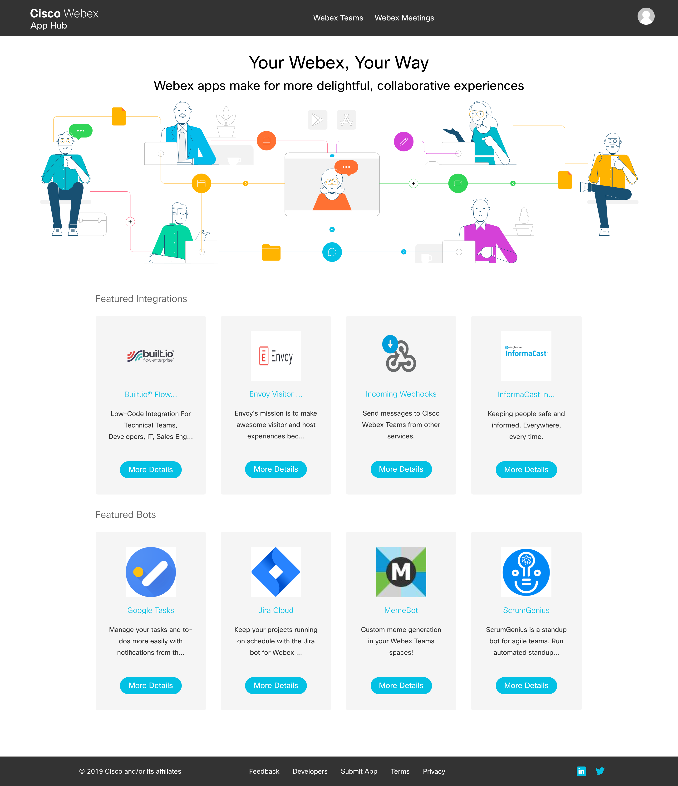
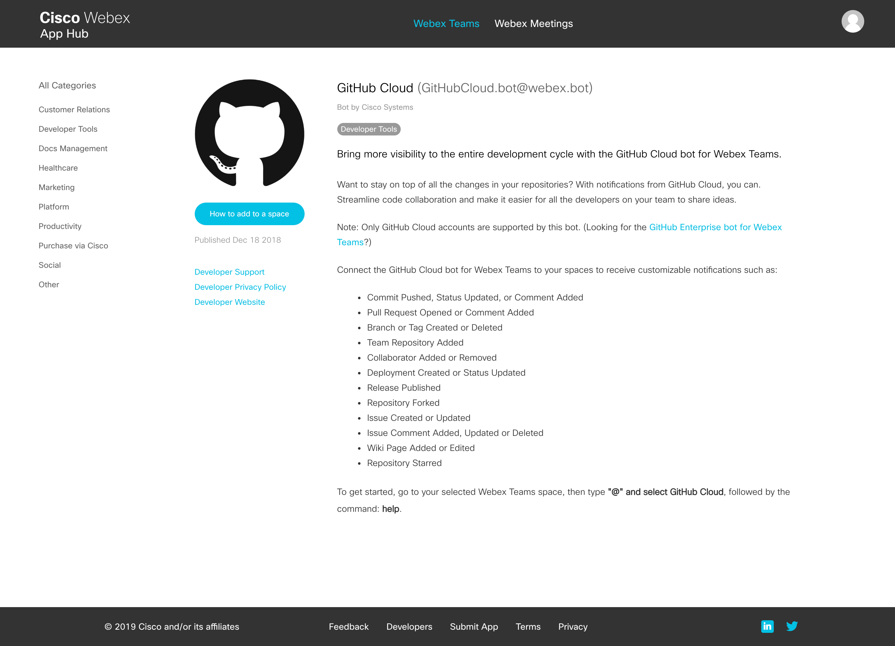

Navigation :: [Previous Page](LTRPRG-1100-02c1-Teams.md) :: [Table of Contents](LTRPRG-1100-00-Intro.md#table-of-contents) :: [Next Page](LTRPRG-1100-02d1-Postman.md)

---

### Exercise 1: Getting Started with Cisco Webex Teams

#### Objectives

The objectives for this exercise are to:

* Sign up for a free Webex Teams account
* Explore Webex Teams Integrations and Bots

#### Step 1: Signing up for a Free Webex Teams Account

If you don't already have a Webex Teams account, then the first thing to do is sign up for a free account. If you 
already have an account and are confident in your ability to log in to it, then please skip to Step 2.

Registering for Webex Teams is free.  However, you will need access to the email account that you register with to 
complete the account verification steps later in this lab.  If you cannot do so, then please ask a proctor for 
assistance and we can provide you with a temporary demo account and skip to Step 2.

1. Navigate to [Webex Teams Web Login](https://teams.webex.com/) at `https://teams.webex.com/` to create your account.

2. Type in your email address that you want to use for your Webex Teams account and click the `Next` button.
    
    

3. If you have not activated an account with this email address, then Webex Teams will send an email to this address 
to complete the account activation process. Open the email that is in your email Inbox waiting for you and enter the 
activation code.

4. Follow the remaining instructions on screen to complete your account signup.
    
    
    
    Once finished, you will be logged into Webex Teams and ready to continue.

#### Step 2: Exploring Webex Teams Integrations and Bots

Once you have an account with Webex Teams, you can use it to access the platform's developer capabilities. 

Webex Teams allows for Integrations and Bots, which expand the functionality and use beyond person-to-person 
collaboration.  An integration is software that can act on your behalf to interact with other systems and services. 
Bots are applications that can send messages into spaces or read messages directed to them, impersonating a human.

1. Check out the available integrations and bots already developed and publicly available. Navigate to the
[Cisco Webex App Hub](https://apphub.webex.com/) at `https://apphub.webex.com/`.  Click the `Log in` button to login 
with your Webex Teams account if you are logged out.
    
    
    
2.  Click the `Webex Teams` link in the webpage header.  This is the list of the public integrations and bots for 
Webex Teams.
    
    
    
    1.  The [Webex Teams integration for IFTTT](https://apphub.webex.com/categories/all/integrations/ifttt-ifttt) 
    allows you to send an IFTTT recipe action to Webex Teams.  IFTTT is a free service that allows you to connect 
    apps and devices to talk to each other.
        
        
    
    2.  The [Webex Teams bot for GitHub](https://apphub.webex.com/categories/all/bots/github-cloud) allows you to 
    receive notifications in Webex Teams when updates are made to a GitHub repository.  The authors of this lab 
    created a Webex Teams space were we could collaborate and communicate on lab content development.  We added the 
    GitHub for Cloud integration to the space and subscribed to the integration notifications that were relevant to 
    our project.
        
        

2. If all of these available integrations and bots are inspirational, it is important to know that you can create 
your own integration or bot!  Note the developer documentation for Webex Teams
[integrations](http://developer.webex.com/docs/integrations) and [bots](http://developer.webex.com/docs/bots) to 
learn more, but here is a quick reminder of the differences between integrations and bots:
    
    * Integrations utilize the Webex Teams API on behalf of other users, via OAuth.
    * Bots are effectively their own users and can send or recieve their own messages.
    
    Also explore the Cisco Live [World of Solutions](https://www.ciscolive.com/us/activities/world-of-solutions.html) 
    to look for vendors showcasing their integrations for NetDevOps.
    
    Later in this lab, we will script a network programmability assistant for ChatOps with Cisco Webex Teams.

Webex Teams is a great tool for teams to collaborate, create a workflow and communications conduit for your team 
and network devices, and is a network programmability dojo for learning and testing APIs in an interactive manner.  
Let's take a look at another tool of the ninja for digging deeper into APIs.

---

Navigation :: [Previous Page](LTRPRG-1100-02c1-Teams.md) :: [Table of Contents](LTRPRG-1100-00-Intro.md#table-of-contents) :: [Next Page](LTRPRG-1100-02d1-Postman.md)
