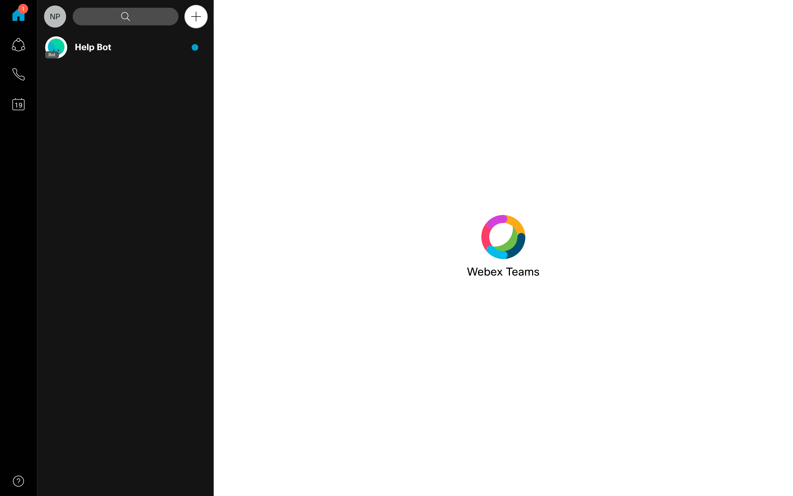
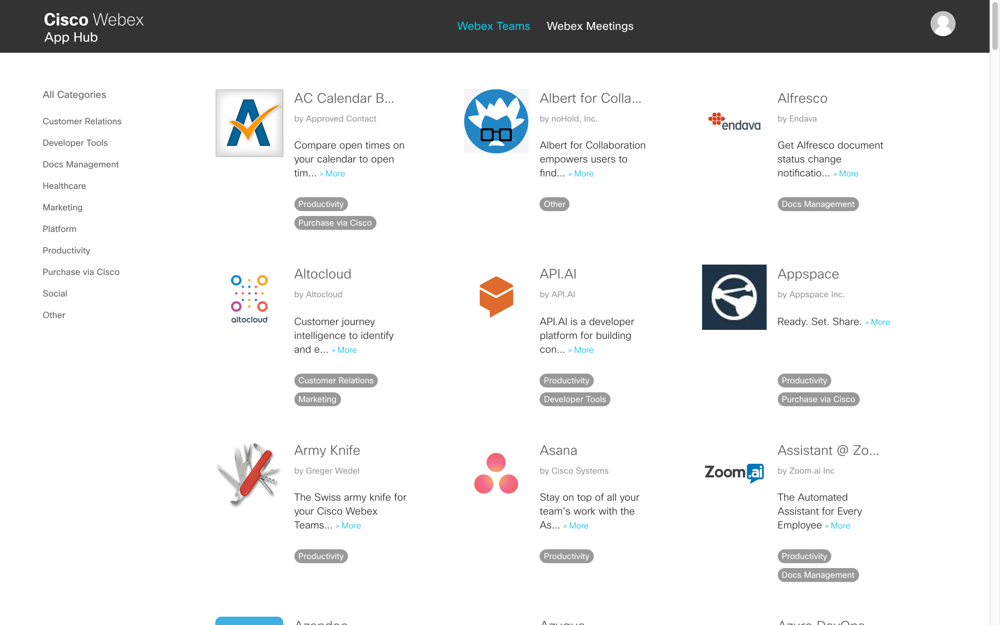
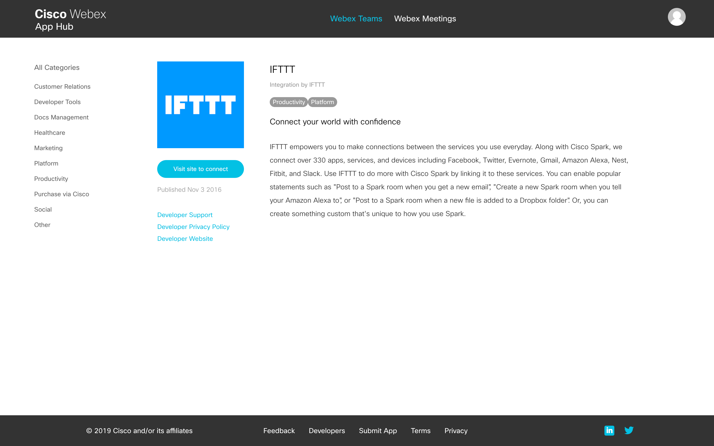

Navigation :: [Previous Page](LTRPRG-1100-02c1-Teams.md) :: [Table of Contents](LTRPRG-1100-00-Intro.md#table-of-contents) :: [Next Page](LTRPRG-1100-02d1-Postman.md)

---

### Exercise 1: Getting Started with Cisco Webex Teams

#### Objectives

The objectives for this exercise are to:

* Sign up for a free Webex Teams account
* Learn how to obtain your Webex Teams API access token
* Understand the fundamentals of the Webex Teams API
* Explore Webex Teams Integrations and Bots

#### Step 1: Signing up for a Free Webex Teams Account

If you don't already have a Webex Teams (formerly Cisco Spark) account, then the first thing to do is sign up for a 
free account. If you already have an account and are confident in your ability to log in to it, then please skip to 
Step 2: Obtaining Your Webex Teams API Access Token

1. Navigate to [Webex Teams Web Login](https://teams.webex.com/): `https://teams.webex.com/` to create your account.

2. Type in your email address that you want to use for your Webex Teams account and click the `Next` button.
    
    
    
3. If you have not activated an account with this email address, then Webex Teams will send an email to this address 
to complete the account activation process. Please click on the activation link that is in your email Inbox waiting 
for you.

4. Follow the instructions on screen to complete your account signup.

#### Step 2: Obtaining Your Webex Teams API Access Token

Once you have an account with Webex Teams, you can use it to access the platform's API. Webex Teams has a really 
well-documented API, so it's important to spend some time learning about it.

1. Navigate to [Cisco Webex for Developers](https://developer.webex.com/getting-started.html#authentication):
`https://developer.webex.com/getting-started.html#authentication` to obtain your access token to use with the Webex 
Teams API. Save this token in a Notepad window for future use in this lab.
    
    

2. Read the rest of the Webex Teams Developer Guide [Getting Started](https://developer.webex.com/getting-started.html) 
for some more information on the Webex Teams API. Read through the use-cases and such.  How can you see this useful 
for you as you embark on network programmability?

#### Step 3: Understanding the Webex Teams APIs

Later in this lab, we will spend more time deep-diving into the logic and details of APIs. For now, it is important 
to understand what kinds of APIs are available and how they can help. Let's run through an overview of some 
important uses of the Webex Teams API.

1. Navigate to the [Cisco Webex Teams API Quick Reference](https://developer.webex.com/quick-reference.html):
`https://developer.webex.com/quick-reference.html` for a high-level overview of what interactions you can take using
the API. Scroll through the page and look at the different functions that are available for the different categories 
of interactions with the Webex Teams platform.
    
    

2. Let's understand what type of info can be gathered through the API. For instance, in the `People` section of the 
quick reference, click on the `Get My Own Details` request.
    
    

3. This site allows for interactive use of the Webex Teams API directly from a web browser, which is really 
helpful to understand how the API works. To utilize this, flip the switch next to `Test Mode` to `ON`.
    
    
    
4. Go ahead and click `Run` to see the response on the right-side column. Without worrying too much about the details
of the structure, notice the information that comes back. With the API call, we are able to pull the user details 
programmatically.

5. Let's use this site to create a room that we can use to further learn the Webex Teams API. Click on `Rooms` on the 
left-hand column under the `Webex Teams API` section (alternatively, you can click
[here](https://developer.webex.com/resource-rooms.html) to get there directly).
    
    

    Click on the `Create a Room` method.  Ensure that the `Test Mode` is turned on.  
    
    
    
6. A room in Webex Teams (referred to as a Space in the app) is a gathering place where team messaging, sharing, and 
collaboration can take place. Name your room something interesting like `CLUS18 LTRPRG-1100`.  We can leave the 
`teamId` blank. The right-hand column should update in real-time with the request structure, shown below. When you 
are ready, click `Run` and monitor the 
right-hand column for results. If you see a `200 / Success` then the room was created!
    
    
    
#### Step 4: Exploring Webex Teams Integrations and Bots

Everything that we've looked at so far allow you to interact as yourself with Webex Teams via the API. While this can
be effective and helpful depending on the task, Webex Teams also allows for Integrations and Bots, which expand the 
functionality and use even further. An integration is software that can act on your behalf to interact with other 
systems. Bots are separate "users" that can send messages into spaces or read messages directed to them.

1. Check out the available integrations already developed and publicly available. Navigate to the
[Cisco Webex App Hub](https://apphub.webex.com/): `https://apphub.webex.com/` to see a list of different integrations
available for use.
    
    

    For example, you can add an
    [integration with GitHub](https://apphub.webex.com/categories/all/integrations/github-cisco-systems) to receive 
    notifications in Webex Teams when updates are made to a repository.
    
    
    
    Spend a few minutes exploring the available bots
    and integrations.

2. If all of these available integrations and bots are inspirational, it is important to know that you can create 
these as well! Check out the documentation for [integrations](https://developer.webex.com/authentication.html) and 
[bots](https://developer.webex.com/bots.html) to learn more, but here is a quick reminder of the differences between 
integrations and bots.
    
    * Integrations utilize the Webex Teams API on behalf of other users, via OAuth.
    * Bots are effectively their own users and can post their own content.

---

Navigation :: [Previous Page](LTRPRG-1100-02c1-Teams.md) :: [Table of Contents](LTRPRG-1100-00-Intro.md#table-of-contents) :: [Next Page](LTRPRG-1100-02d1-Postman.md)
