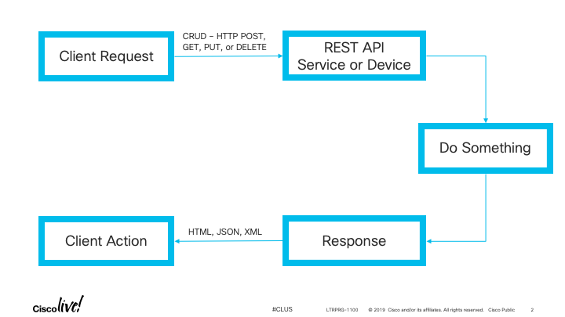

Navigation :: [Previous Page](LTRPRG-1100-03b1-REST.md) :: [Table of Contents](LTRPRG-1100-00-Intro.md#table-of-contents) :: [Next Page](LTRPRG-1100-03b3-REST-Ex2.md)

---

### Exercise 1: Understanding REST APIs

#### Objectives

The objectives of this exercise are to:

* Understand REST API communication
* Understand the anatomy of a REST API call

#### Step 1: Understanding REST API Communication

While there are standards that APIs typically follow, the particular calls, parameters, and expected results differ 
with every API. From a commonality standpoint, many APIs utilize the same architectural style called REST. REST, or 
Representational State Transfer, is based on core HTTP functions such as GET, POST, PUT, and DELETE.  Let's take a 
closer look at REST API communication.

A web browser retrieves web pages by requesting resources from a web server.  The web server responds with the 
resource formatted in HTML.  This HTML-formatted data is processed by the web browser and displayed for you in the 
web browser window.  The application protocol used is HyperText Transfer Protocol (HTTP), or HTTPS if secured with 
SSL or TLS.  Behind the scenes, HTTP(S) uses "CRUD" (Create, Read, Update, Delete) operations to achieve this 
request and transfer of information.  The CRUD operations are the four basic functions from which a good API is 
designed:

* Create - A programmatic function to add something
* Read - A programmatic function to retrieve something
* Update - A programmatic function to change something
* Delete - A programmatic function to remove something

In a RESTful API, CRUD corresponds to the HTTP methods POST, GET, PUT, and DELETE, respectively.

A web browser is just one client used to interface with REST APIs.  Postman, as we saw earlier in this lab, is
another interface with REST APIs.  Two web services like Webex Teams and Cisco DNA Center can also communicate using 
REST APIs.

The general flow of a REST API is shown below:

#### Step 2: Understanding the Anatomy of a REST API Call

We briefly introduced how to craft a REST API call earlier in the lab when we introduced Postman.  Let's dig a 
little deeper here.

1. You must choose the CRUD operation as an HTTP method, for example:
    
    * POST - Create something new, e.g. create a new managed network device
    * GET - Retrieve something that exists, e.g. list the network hosts connected to a site
    * PUT - Update something that exists, e.g. change a configuration element of a managed network device
    * DELETE - Remove something that exists, e.g. delete a managed network device

2. You must provide the URL for the REST API service to complete the appropriate action.  A URL is formed in the 
following manner: `https://api.ciscospark.com/v1/rooms`.
    
    * `https` - The application protocol, i.e. Secure HTTP
    * `api.ciscospark.com` - The IP address of fully qualified domain name (FQDN) of the REST API service or network 
    device
    * `/v1/rooms` - The REST API path to complete the request

3. You will likely have to authenticate the REST API call.  There are different HTTP authorization types, and which 
type used varies from API service or host.  Basic (username and password), token based, and OAuth are common HTTP 
authentication types.

4. HTTP headers are used to describe the HTTP connection, for example an HTTP header `application/json` tells the the
 client or server/host to expect JSON-formatted text in the HTTP body text.
 
5. The HTTP body text of an API request or response, typically formatted in JSON, is used to complete the request or 
respond to a request.

6. The HTTP response to an API call contains an HTTP status code.  Here are common HTTP status codes for reference:
    
    * Success Codes (2xx)
        * `200 OK` - The request was fulfilled
        * `202 Accepted` - The request was accepted for processing, but processing has not yet completed
        * `204 No Response` - The request was received, but there was no information to send back
    * Error Codes (4xx/5xx)
        * `400 Bad Request` - The request was malformed with bad syntax
        * `401 Unauthorized` - The request requires authorization or authorization failed
        * `403 Forbidden` - The request authorization succeeded, but access was denied
        * `404 Not Found` -  The request did not match anything, likely due to a wrong URL path
        * `500 Internal Server Error` - The server encountered an unexpected error condition

Now that we've introduced the anatomy of an REST API call, let's explore some examples.

---

Navigation :: [Previous Page](LTRPRG-1100-03b1-REST.md) :: [Table of Contents](LTRPRG-1100-00-Intro.md#table-of-contents) :: [Next Page](LTRPRG-1100-03b3-REST-Ex2.md)
