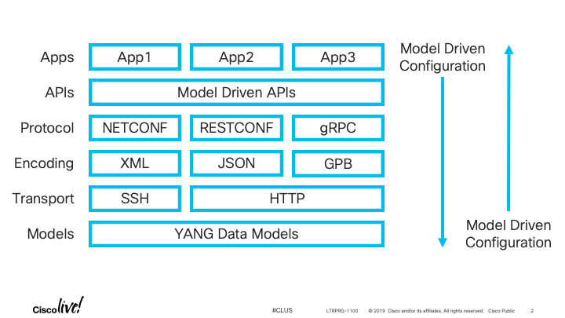

Navigation :: [Previous Page](LTRPRG-1100-03b2-REST-Ex1.md) :: [Table of Contents](LTRPRG-1100-00-Intro.md#table-of-contents) :: [Next Page](LTRPRG-1100-03c2-NETCONF-Ex1.md)

---

## Model Driven Programmability

### Introducing Model Driven Programmability

Traditional network device management techniques, for example command line interface (CLI) and web user interface 
(web UI), were designed for human to machine interaction for configuring and accessing operational details.  They by 
definition are not programmable.  Although attempts at automation through screen scraping or imitating interactive 
sessions are possible, they are error prone, unreliable, and do not scale.

The need for reliable and scalable ways to manage network devices is not a new one.  Simple Network Management Protocol 
(SNMP) was first introduced as a IETF Internet Standard in 1988 as a standard interface to configure and retrieve 
operational information from network devices.  SNMP was revised over the years, chiefly to improve performance and 
security of the protocol.  However, SNMP still isn't adequate for the job today, relegated to polling statistics and 
status.

In 2003, the IETF published [RFC3535](https://tools.ietf.org/html/rfc3535) *Overview of the 2002 IAB Network 
Management Workshop*, stating

> SNMP works reasonably well for device monitoring.

SNMP was found to be lacking in the following ways:

* Applications are necessary for SNMP to be useful
* Lack of writeable MIBs in general, and lack writeable MIBs for configuration specifically
* Does not scale
* Too difficult to implement
* Lack of support for configuration retrieval or playback
* Mismatch between SNMP data-centric view of the world versus an operator's task-oriented view of the world 

The solution lies in using data models - a programmatic and standards-based way of describing how to configure any 
network device. You should move to use model driven programmability to replace the process of manual configuration.  
Model driven programmability inherits the power of models, making it easier to configure network devices.  It overcomes 
drawbacks posed by traditional network device management techniques.

The model driven programmability stack from model to application is shown below:

To this end, the IETF went to work and created a few new Internet Standards to help address these shortcomings and 
move to model driven programmability: NETCONF and YANG.

---

Navigation :: [Previous Page](LTRPRG-1100-03b2-REST-Ex1.md) :: [Table of Contents](LTRPRG-1100-00-Intro.md#table-of-contents) :: [Next Page](LTRPRG-1100-03c2-NETCONF-Ex1.md)
