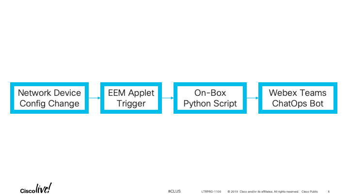

Navigation :: [Previous Page](LTRPRG-1100-04b2-PortTrack-Ex1.md) :: [Table of Contents](LTRPRG-1100-00-Intro.md#table-of-contents) :: 
[Next Page](LTRPRG-1100-04c2-NetAssist-Ex1.md)

---

## Script a Network Programmability Assistant for Cisco Webex Teams

### Defining the Problem

How many times have you been asked, “Are you sure nothing has changed on the network?”  Before a change, whether 
planned or unplanned, you could yell over the cube wall or email your team to warn them.  Wouldn't it be nice if your
network devices did the talking for you?  Wouldn't it be nice to have a running record of network device 
configuration changes in a convenient location where you collaborate with your peers?

ChatOps is a collaborative, conversation-centric way of doing business that brings people, Bots, messaging, 
applications, and network devices together in one platform.  Such a platform, of course, is Webex Teams.  ChatOps 
allows you to clearly and quickly see what and where the problem is.  The goal is to increase transparency and 
productivity through integrating through and efficient and robust collaboration platform. 

### Defining the Test

By leveraging a winning combination of Embedded Event Manager (EEM) and on-box network programmability using Python 
in Guest Shell, your network device can notify you when its configuration has changed.  Using all of the tools and 
concepts introduced and developed in this lab so far, we will create the following ChatOps flow:

---

Navigation :: [Previous Page](LTRPRG-1100-04b2-PortTrack-Ex1.md) :: [Table of Contents](LTRPRG-1100-00-Intro.md#table-of-contents) :: 
[Next Page](LTRPRG-1100-04c2-NetAssist-Ex1.md)
